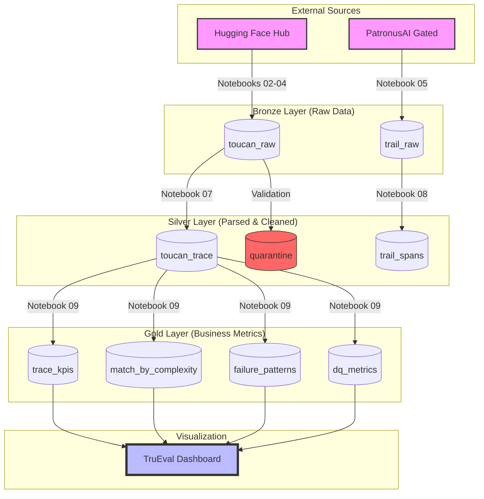

<!-- Author: Rajesh Daggupati -->
# 🔍 TruEval: Agentic Trace Observability Pipeline

**TruEval** is a high-scale Databricks Lakehouse pipeline designed to answer a single, critical question in the era of Agentic AI: **When agents have access to the right tools, do they actually use them?**

By analyzing **1.19 Million** execution traces from three state-of-the-art models (SFT, Kimi-K2, Qwen3), TruEval provides deep visibility into model reliability, tool-call accuracy, and failure patterns across varying levels of task complexity.

---

## 🏗️ System Architecture

The pipeline follows a classic **Medallion Architecture**, transforming raw, nested JSON payloads into high-performance analytical tables.

---

## 📈 Key Insights

*   **The 47% Ceiling:** Across all 1.19M traces, models successfully matched the expected tool calls only **47.3%** of the time.
*   **Complexity Cliff:** Success rates are near **100%** for single-tool tasks but plummet to **~25%** when tasks require 6 or more tool calls.
*   **Model Performance:** The SFT model leads (49%), followed by Kimi-K2 and Qwen3 (46%).
*   **Failure Hotspots:** Weather and Dictionary MCP servers are the top failure points, usually due to argument naming hallucinations (e.g., passing `word` when the tool expects `query`).

---

## 🛠️ Tech Stack

*   **Platform:** Databricks (Unity Catalog enabled)
*   **Engine:** Apache Spark (PySpark)
*   **Storage:** Delta Lake (Medallion Architecture)
*   **Orchestration:** Databricks Workflows
*   **Monitoring:** Custom Data Quality (DQ) Audit Framework

---

## 🚀 Pipeline Flow

The project is organized into 10 sequential notebooks.

### 1. Setup & Ingestion
*   `01_setup_trueval_environment`: Initializes Unity Catalog schemas.
*   `02_ingest_raw_toucan_sft`: Bootstraps the pipeline with the first 119K SFT traces.
*   `03_ingest_toucan_sft_backfill`: Completes the SFT ingestion via shards.
*   `04_ingest_toucan_kimi_qwen_scale`: Scales to the full 1.1M+ rows for larger models.
*   `05_ingest_trail_benchmark_gated`: Integrates the TRAIL benchmark (GAIA/SWE-Bench).

### 2. Transformation & Enrichment
*   `06_profile_bronze_traces`: Exploratory Data Analysis (EDA) of raw JSON payloads.
*   `07_transform_silver_toucan_traces`: The core engine. Implements multi-format JSON parsing and `endsWith` tool-mapping.
*   `08_transform_silver_trail_errors`: Flattens benchmark errors for granular analysis.

### 3. Analytics & Validation
*   `09_aggregate_gold_performance_kpis`: Computes headline KPIs, complexity buckets, and failure patterns.
*   `10_verify_pipeline_data_quality`: Executes an 11-step audit to ensure pipeline health.

---

## 🧠 Engineering Decisions

### Why a Composite Key?
UUIDs in the Toucan dataset are shared across model subsets. Using `uuid` as a primary key caused **127,000 duplicate collisions**. We implemented a composite key `(uuid, model_name)` to ensure 1:1 trace tracking.

### Multi-Format Parsing
Different models use different message roles. SFT uses `tool_call`, while Kimi uses `assistant` with a `function_call` object. Our Silver layer implements a polymorphic parser that detects and handles both formats dynamically.

### Idempotency by Design
Each ingestion shard is tagged with a `source` label. Before writing, the pipeline performs a lookup. If the shard is already present, it is skipped. This makes the pipeline resilient to cluster failures and easy to resume.

---

## 📊 Data Dictionary (Gold Layer)

| Table | Grain | Purpose |
| :--- | :--- | :--- |
| `trace_kpis` | Summary (1 row) | Headline metrics: volume, avg match rate, success % |
| `match_by_complexity` | Complexity Bucket | Performance breakdown from 1-tool to 6+ tool tasks |
| `failure_patterns` | MCP Server | Top 10 servers associated with 0% match rates |
| `dq_metrics` | DQ Rule | Real-time health status of the entire pipeline |

---

## 🖼️ Visualizations

### Pipeline Orchestration

### Performance Dashboard

---

## 📝 Author
**Rajesh Daggupati**
*   Lakehouse Architect & AI Engineer
